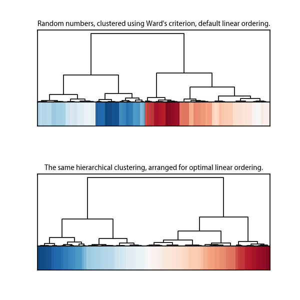
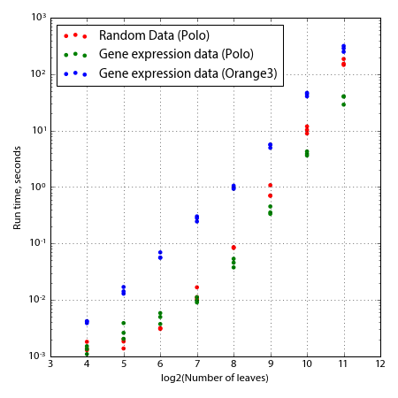

Python Optimal Leaf Ordering for Hierarchical Clustering
========================================================

Polo is a python script to obtain optimal linear ordering of hierarchical clusters, 
using the algorithm described in [Fast Optimal leaf ordering for hierarchical clustering]
(http://bioinformatics.oxfordjournals.org/content/17/suppl_1/S22.long), *Bioinformatics 2001*
by Ziv Bar-Joseph, David K. Gifford, Tommi S. Jaakkola.

When a hierarchical cluster with n leaves is displayed as a dendrogram, there are 
2^(n-1) possible trees to display. The optimal linear ordering is the one where the
distance between successive leaves is minimized (even when the leaves come from different
clusters).

Here is an example of the default ordering obtaining from fastcluster's linkage function,
compared to the optimal linear order.

Polo is significantly faster than Orange3 which also implements optimal leaf ordering.
As with the original alrogithm, it performs better on real data than random data (which 
most closely approximate the worst case balanced binary tree.)

Installing
----------
Polo was created and tested in Python 3.5, but should work with 2.7 and 3.4.

    pip install polo

Usage
-----

    from polo import optimal_leaf_ordering
    #D = ... your distance matrix
    #Z = ... your linkage matrix
    optimal_Z = optimal_leaf_ordering(Z, D)

Example
-------

    # Use fastcluster's linkage whenever possible. 
    import numpy as np
    from scipy.spatial.distance import pdist
    from fastcluster import linkage
    from polo import optimal_leaf_ordering

    np.random.seed(0)
    data = np.random.choice(10000, (n, 1), replace=False)

    D = pdist(data, 'euclidean')
    Z = linkage(D, 'ward')
    
    optimal_Z = optimal_leaf_ordering(Z, D)

